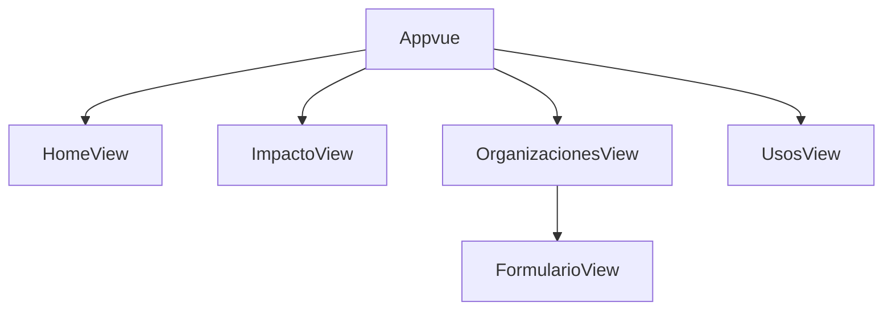
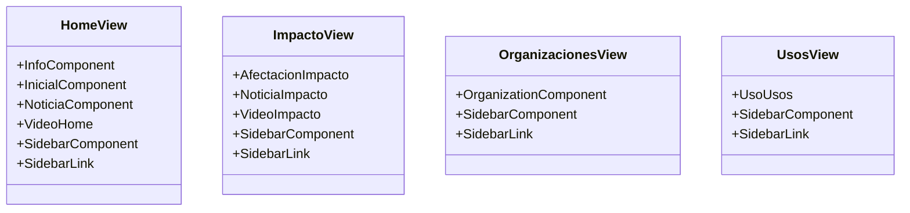

# Kelpme  -    HACK THE OCEAN
---
Esta es la carpeta que contiene el proyecto de frontend.
---

## Deploy en https://proud-bay-0cea1ee10.1.azurestaticapps.net/

#### Tecnologías usadas

Para este proyecto nos decidimos por utilizar una **SPA** hecha **Vue.js**, a continuación mostramos una guía de como
utilizar este proyecto.

#### Configuración del sitio

Instalación de los paquetes necesarios

 ``` 
 npm install
 ```

Es necesario crear un archivo .env con las variables de entorno siguientes

```
VUE_APP_KELP_ME_API_URL="http://url_al_backend_sin_diagonal_al_final"
```

Ejecución de la SPA en modo prueba

```
npm run serve
```

Creación de build para producción(se requiere un servidor de contenido estático)

```
npm run build
```

## Diagramas de flujo de las vistas


## Diagrama de los componentes


## Dependencias usadas en el proyecto frontend

- Vue.js -- Vue.js is an open-source model–view–viewmodel front end JavaScript framework for building user interfaces and single-page applications. It was created by Evan You, and is maintained by him and the rest of the active core team members


- Bootstrap -- Bootstrap is a free and open-source CSS framework directed at responsive, mobile-first front-end web development. It contains HTML, CSS and JavaScript-based design templates for typography, forms, buttons, navigation, and other interface components.

- Font Awesome -- Font Awesome is a font and icon toolkit based on CSS and Less. As of 2020, Font Awesome was used by 38% of sites that use third-party font scripts, placing Font Awesome in second place after Google Fonts.


##Capturas de las vistas del proyecto

- Vista home


- Vista impacto


- Vista Usos


- Vista para registrar una organización


